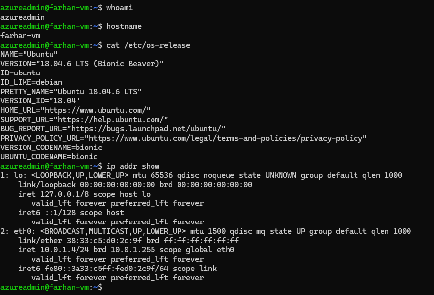
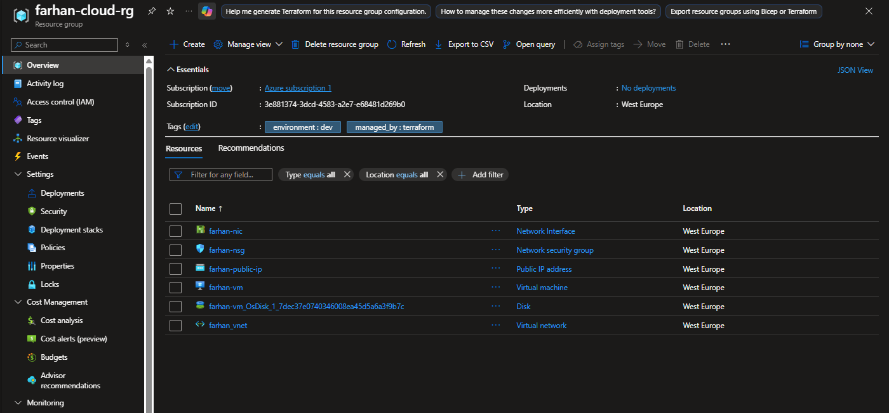
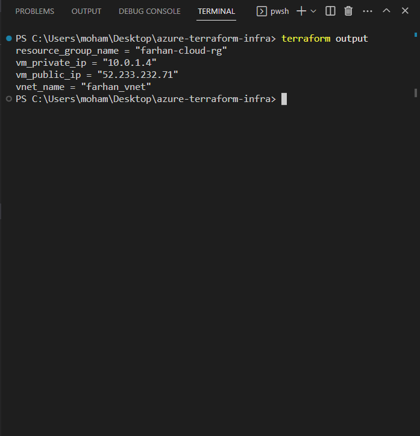

# Azure Cloud Infrastructure with Terraform

## Overview

Production-grade Azure infrastructure built with Terraform. Covers remote state management, network security, modular variables, and GitOps principles.

## Architecture

Resource Group (farhan-cloud-rg)
├── Virtual Network (10.0.0.0/16)
│   └── Subnet (10.0.1.0/24)
│       └── Network Security Group (SSH inbound)
├── Public IP (Static, Standard SKU)
├── Network Interface
└── Linux Virtual Machine (Ubuntu 18.04 LTS)

## Resources

| Resource | Name |
|----------|------|
| Resource Group | farhan-cloud-rg |
| Virtual Network | farhan-vnet |
| Subnet | farhan-subnet |
| Network Security Group | farhan-nsg |
| Public IP | farhan-public-ip |
| Network Interface | farhan-nic |
| Virtual Machine | farhan-vm |

## Engineering Decisions

- **Remote state** stored in Azure Blob Storage with state locking — prevents concurrent apply conflicts in team environments
- **Standard SKU** used for Public IP — Basic SKU is being retired by Azure
- **Static IP allocation** — consistent external address for DNS and firewall rules
- **Pessimistic version constraint** (~> 3.0) — allows minor updates, blocks breaking major version jumps
- **Sensitive variables** — admin password never appears in logs or pipeline output
- **Environment tags** — all resources tagged for cost tracking, RBAC scoping, and safe cleanup

## Prerequisites

- Terraform >= 1.0
- Azure CLI
- Active Azure subscription

## Backend Setup

Run once before terraform init:

```bash
az group create --name tfstate-rg --location westeurope

az storage account create \
  --name tfstatefarhan01 \
  --resource-group tfstate-rg \
  --location westeurope \
  --sku Standard_LRS

az storage container create \
  --name tfstate \
  --account-name tfstatefarhan01
```

## Deployment

```bash
terraform init
terraform plan
terraform apply
terraform destroy
```

## Screenshots

### Live VM via SSH


### Azure Portal — Resources


### Terraform Outputs


## Security Notes

- SSH rule currently allows 0.0.0.0/0 — production should restrict to bastion host or VPN IP
- Password authentication enabled for demo purposes — production uses SSH keys only
- Storage account should enforce TLS 1.2 minimum in production

## Author

Mohammed Farhan Ali — Cloud Engineer  
[LinkedIn](https://linkedin.com/in/mohammed-farhan-ali)
